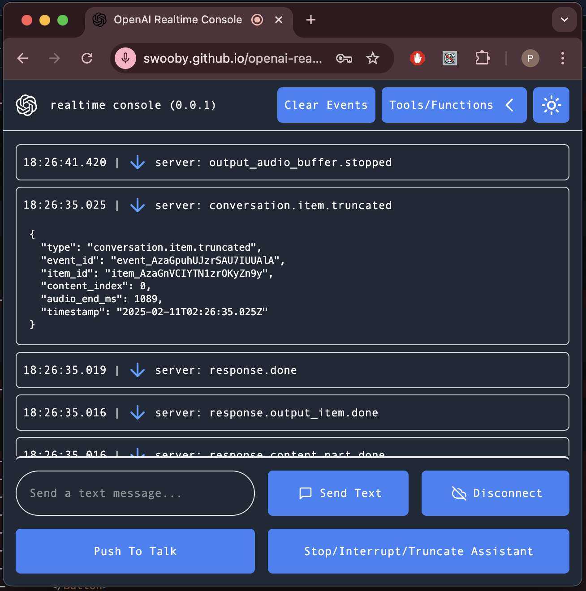

# OpenAI Realtime Console: Push-To-Talk (PTT)

## Demo
<div align="center">
<a href="https://swooby.github.io/openai-realtime-push-to-talk/">
<div>

</div>
<div>
https://swooby.github.io/openai-realtime-push-to-talk/
</div>
</a>
</div>

---

**This fork of https://github.com/openai/openai-realtime-console was created on 2025/02/07 and is a work in progress for a hosted demo Push-To-Talk test webapp for the OpenAI Realtime WebRTC [and maybe future retro WebSocket] API.**

---

This is an example application showing how to use the [OpenAI Realtime API](https://platform.openai.com/docs/guides/realtime) with [WebRTC](https://platform.openai.com/docs/guides/realtime-webrtc).

## Installation and usage

Before you begin, you'll need an OpenAI API key - create one at https://platform.openai.com/settings/api-keys with the following permissions:
* `Models` = `Read`
* `Model capabilities` = `Write`

Save the generated key in a safe place and enter it in the "OpenAI API Key" field in the main page.

**This [[fully open source](https://github.com/swooby/openai-realtime-push-to-talk/blob/30ef22ad9ae6a0bb4b0d0893e96629dcfba2a4d1/client/components/App.jsx#L33-L78)] app only ever uses your OpenAI API Key to directly request a one-minute ephemeral key from `api.openai.com`.**  
**The key is otherwise never logged, stored, or sent anywhere else.**

Code pushed to `main` automatically deploys to the cloud, so the code running in the cloud **IS** the code that is on `main`.

**THIS IS SAFE!** There is effectively zero difference in risk between:
1. You entering your [dangerous] OpenAI API Key in an open source cloud run client only app.  
   *-and/or-*
2. You entering that same key in an .env file for a locally run open source server + client app.

You still have to review and trust the code either way; You can always run the client only code locally if you don't trust the cloud run version. If you trust running the code locally on your machine and not from the cloud then you may have trust issues.

---

Running this application locally requires [Node.js](https://nodejs.org/) to be installed. Install dependencies for the application with:

```bash
npm install
```

Start the application server with:

```bash
npm run dev
```

This should start the console application on [http://localhost:3000](http://localhost:3000).

This application is a minimal template that uses [vite](https://vitejs.dev/) to build the React frontend contained in the [`/client`](./client) folder.

This application shows how to send and receive Realtime API events over the WebRTC data channel and configure client-side function calling.
You can also view the JSON payloads for client and server events using the logging panel in the UI.

For a more comprehensive example, see the [OpenAI Realtime Agents](https://github.com/openai/openai-realtime-agents) demo built with Next.js,
using an agentic architecture inspired by [OpenAI Swarm](https://github.com/openai/swarm).

## Previous WebSockets version

The previous version of this application that used WebSockets on the client (not recommended in browsers) [can be found here](https://github.com/openai/openai-realtime-console/tree/websockets).

## License

MIT
